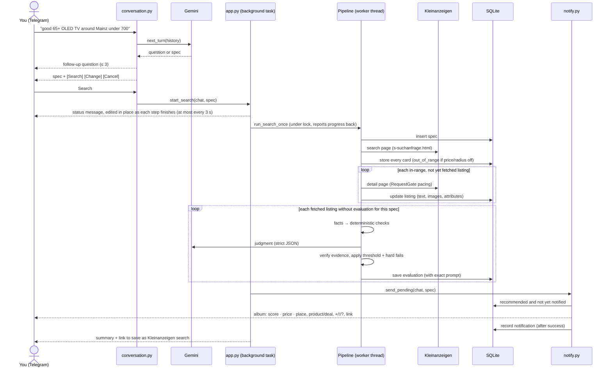
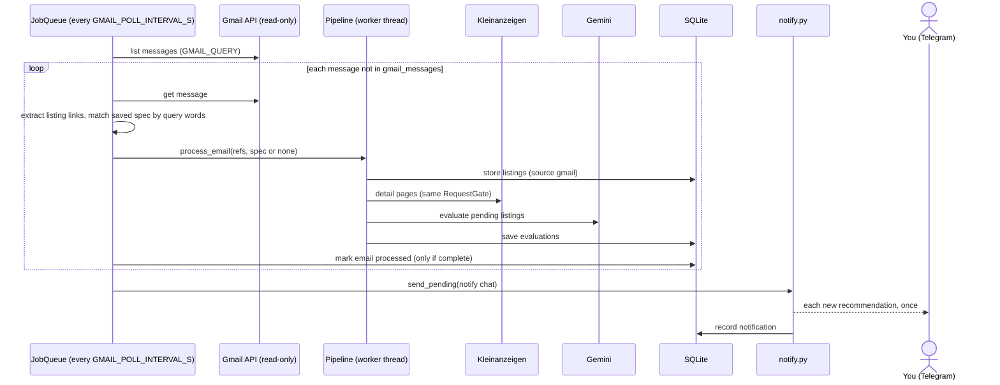

# Flows

## Interactive search

```mermaid
sequenceDiagram
    actor U as You (Telegram)
    participant C as conversation.py
    participant L as Gemini
    participant A as app.py (background task)
    participant P as Pipeline (worker thread)
    participant K as Kleinanzeigen
    participant D as SQLite
    participant N as notify.py

    U->>C: "good 65+ OLED TV around Mainz under 700"
    C->>L: next_turn(history)
    L-->>C: question or spec
    C-->>U: follow-up question (≤ 3)
    C-->>U: spec + [Search] [Change] [Cancel]
    U->>C: Search
    C->>A: start_search(chat, spec)
    A-->>U: status message, edited in place as each step finishes (at most every 3 s)
    A->>P: run_search_once (under lock, reports progress back)
    P->>D: insert spec
    P->>K: search page (s-suchanfrage.html)
    P->>D: store every card (out_of_range if price/radius off)
    loop each in-range, not yet fetched listing
        P->>K: detail page (RequestGate pacing)
        P->>D: update listing (text, images, attributes)
    end
    loop each fetched listing without evaluation for this spec
        P->>P: facts → deterministic checks
        P->>L: judgment (strict JSON)
        P->>P: verify evidence, apply threshold + hard fails
        P->>D: save evaluation (with exact prompt)
    end
    A->>N: send_pending(chat, spec)
    N->>D: recommended and not yet notified
    N-->>U: album: score · price · place, product/deal, +/!/?, link
    N->>D: record notification (after success)
    A-->>U: summary + link to save as Kleinanzeigen search
```

## Gmail monitoring

```mermaid
sequenceDiagram
    participant J as JobQueue (every GMAIL_POLL_INTERVAL_S)
    participant G as Gmail API (read-only)
    participant P as Pipeline (worker thread)
    participant K as Kleinanzeigen
    participant L as Gemini
    participant D as SQLite
    participant N as notify.py
    actor U as You (Telegram)

    J->>G: list messages (GMAIL_QUERY)
    loop each message not in gmail_messages
        J->>G: get message
        J->>J: extract listing links, match saved spec by query words
        J->>P: process_email(refs, spec or none)
        P->>D: store listings (source gmail)
        P->>K: detail pages (same RequestGate)
        P->>L: evaluate pending listings
        P->>D: save evaluations
        J->>D: mark email processed (only if complete)
    end
    J->>N: send_pending(notify chat)
    N-->>U: each new recommendation, once
    N->>D: record notification
```
