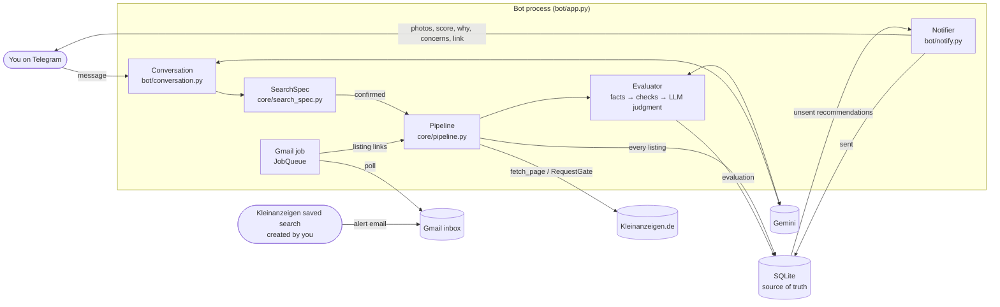

# Overview

Two ingestion paths, one pipeline, one database. Module paths are relative to `offer_finder/`.

```mermaid
flowchart LR
    user([You on Telegram])
    saved([Kleinanzeigen saved search<br/>created by you])

    subgraph bot["Bot process (bot/app.py)"]
        conv["Conversation<br/>bot/conversation.py"]
        spec["SearchSpec<br/>core/search_spec.py"]
        job["Gmail job<br/>JobQueue"]
        pipe["Pipeline<br/>core/pipeline.py"]
        eval["Evaluator<br/>facts → checks → LLM judgment"]
        notify["Notifier<br/>bot/notify.py"]
    end

    ka[(Kleinanzeigen.de)]
    gmail[(Gmail inbox)]
    llm[(Gemini)]
    db[(SQLite<br/>source of truth)]

    user -- message --> conv --> spec
    spec -- confirmed --> pipe
    saved -- alert email --> gmail
    job -- poll --> gmail
    job -- listing links --> pipe
    pipe -- "fetch_page / RequestGate" --> ka
    pipe -- every listing --> db
    pipe --> eval
    eval <--> llm
    conv <--> llm
    eval -- evaluation --> db
    db -- unsent recommendations --> notify
    notify -- photos, score, why, concerns, link --> user
    notify -- sent --> db
```
